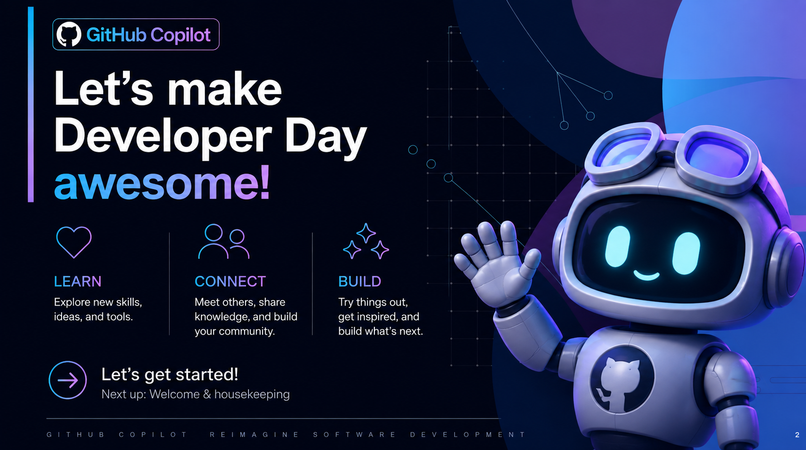
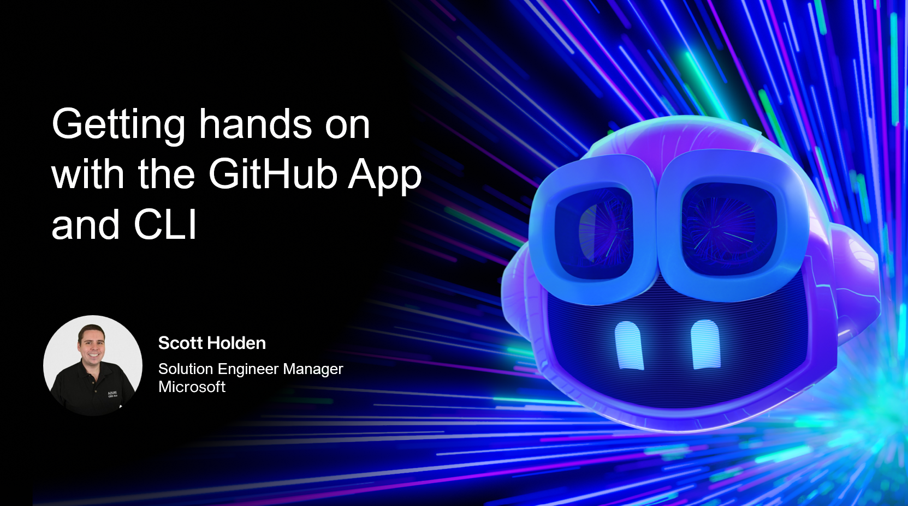
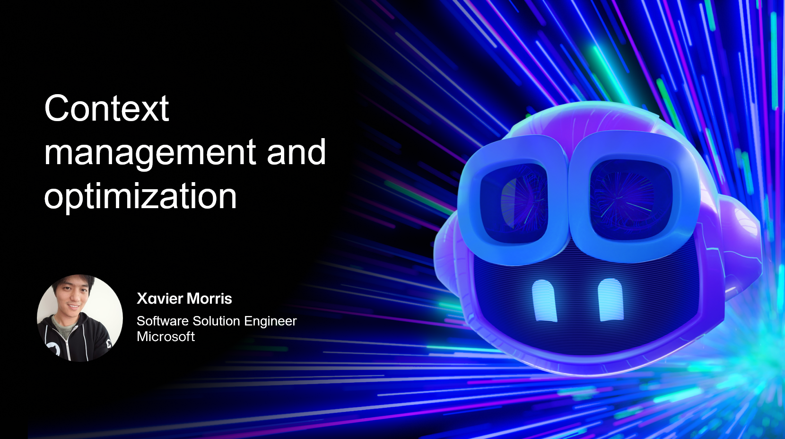
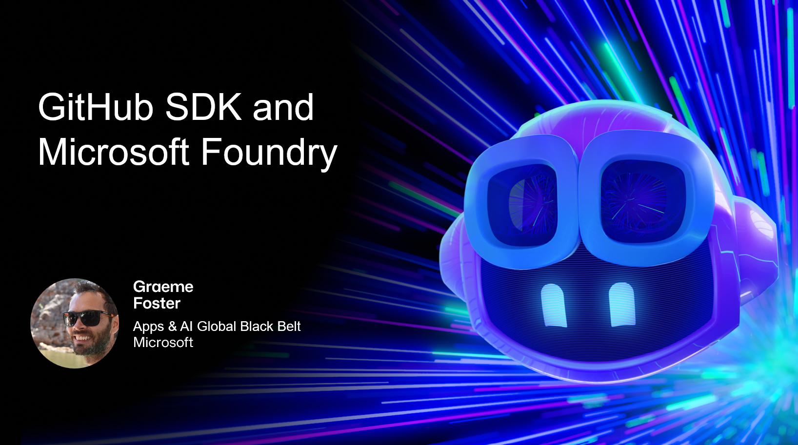

# GitHub Developer Day - Perth

<figure class="gdd-hero">
  
</figure>

## Welcome 👋

This is the companion site for **GitHub Developer Day Perth** - a hands-on look at
agentic coding with GitHub Copilot: what it means, how to get productive with the
GitHub App and CLI, how to manage context as sessions grow, and how to build on top
of it all with the GitHub Copilot SDK and Microsoft Foundry.

Each session below has its own page with the hero slide (where available), a deeper
write-up than you'll see on stage, and links to go further after today.

!!! tip "How to use this site"
    Use the navigation tabs above (or the menu on mobile) to jump straight to a
    session. Toggle **light/dark mode** with the sun/moon icon in the top bar -
    your preference is remembered automatically.

## Agenda

<ul class="gdd-agenda">
  <li>
    <a href="keynote/">Keynote: Agentic Coding - What does it actually mean?</a>
  </li>
  <li>
    <a href="github-app-cli/">Getting hands on with the GitHub App and CLI</a>
  </li>
  <li>
    <a href="context-management/">Context management and optimization</a>
  </li>
  <li>
    <a href="sdk-foundry/">GitHub SDK and Microsoft Foundry</a>
  </li>
</ul>

## Sessions at a glance

  <a class="gdd-card" href="keynote/">
    
    

      Keynote
      <h3>Agentic Coding: What does it actually mean?</h3>
      
Why the shift from "AI in your app" to "your app is the agent" changes how we build and secure software.

    

  </a>

  <a class="gdd-card" href="github-app-cli/">
    
    

      Hands on
      <h3>Getting hands on with the GitHub App and CLI</h3>
      
Six surfaces, one Copilot subscription - install the CLI, tour the desktop app, and see how governance flows down.

    

  </a>

  <a class="gdd-card" href="context-management/">
    
    

      Deep dive
      <h3>Context management and optimization</h3>
      
Keeping long agent sessions fast, cheap, and accurate as your codebase and conversation history grow.

    

  </a>

  <a class="gdd-card" href="sdk-foundry/">
    
    

      Build
      <h3>GitHub SDK and Microsoft Foundry</h3>
      
A programmable agent harness you can embed in your own apps, tools, and services.

    

  </a>

## Want to keep exploring?

Head to the [**Resources**](resources.md) page for the full list of links - Awesome
Copilot, the Copilot SDK, the GitHub Copilot App, Spec Kit, and more.
