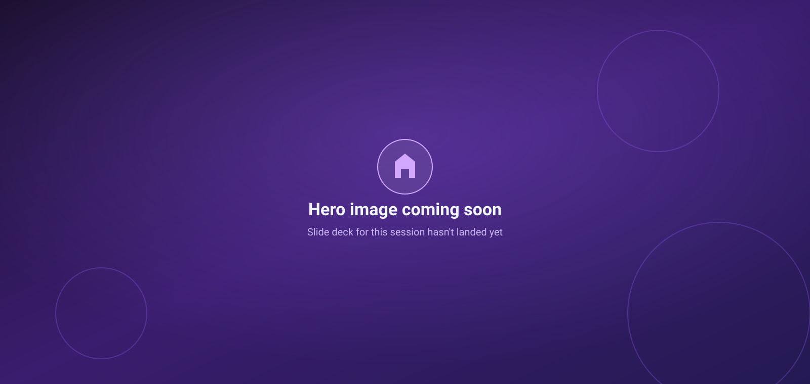

# Keynote — Agentic Coding: What does it actually mean?

<figure class="gdd-hero">
  
  <figcaption>Hero image placeholder — swap in the real keynote title slide once it's available.</figcaption>
</figure>

**9:30 – 10:15am**

## The vibe shift

For the last couple of years, "AI in your app" meant a chat box bolted onto the
side of a product. That era is over. In 2026, the app increasingly *is* the
agent: it plans, it calls tools, it edits files, it opens pull requests, and it
does all of that with a level of autonomy that used to require a human at the
keyboard.

That's the "vibe shift" at the heart of this keynote: **you are not behind,
you are exactly where you need to be.** The skills that make a good engineer —
reading code critically, understanding systems, thinking about risk and
blast radius — are *more* relevant than ever, not less. Agentic coding doesn't
remove the need for engineering judgement; it moves that judgement earlier,
into how you scope, supervise, and review the agent's work.

## What is an AI agent, actually?

Strip away the marketing and an agent is a loop:

  

    <h4>1. Perceive</h4>
    
Read the repository, the issue, the terminal output, the test failures — whatever context it's been given.

  

  

    <h4>2. Reason</h4>
    
Plan the next step using a language model, weighing tools available and constraints in force.

  

  

    <h4>3. Act</h4>
    
Call a tool — run a command, edit a file, open a PR, query an API — inside the permissions it's been granted.

  

  

    <h4>4. Observe</h4>
    
Look at the result, decide whether the goal is met, and loop back to reasoning if not.

  

Every step in that loop is also, worth remembering, an attack surface. A
malicious file, a poisoned dependency, or a crafted issue comment can all
attempt to steer the "reason" step. That's why the second half of this talk
track (context, governance, and the SDK sessions) matters just as much as the
productivity story.

## The agent spectrum

Not all agents are equal, and your posture should match the level of autonomy
in play:

- **Assisted** — suggestions only, human types every change (classic
  autocomplete).
- **Supervised** — the agent proposes a batch of changes, a human approves
  each tool call or diff before it lands.
- **Delegated** — the agent runs a scoped task end-to-end (e.g. "fix this
  failing test") and opens a PR for review.
- **Autonomous / multi-agent** — multiple agents coordinate on longer-running
  work with minimal human intervention, checked by policy and CI rather than
  a person watching every step.

The further right you move on that spectrum, the more your security,
review, and audit practices need to catch up — which is exactly what the
rest of today's sessions cover.

## Cloud-native agents in the SDLC

Agents aren't just showing up at the coding step. Expect to see them across
the whole delivery lifecycle: triaging issues, writing and reviewing PRs,
investigating incidents, updating dependencies, and summarising release
notes. Each of those stages has its own tools, its own blast radius, and its
own governance question — "what is this agent allowed to touch, and who is
accountable if it gets it wrong?"

!!! note "Where this leads"
    The rest of today builds directly on this idea: [Getting hands on with the
    GitHub App and CLI](github-app-cli.md) shows the surfaces you'll actually
    use, [Context management and optimization](context-management.md) covers
    how to keep long agent sessions accurate, and [GitHub SDK and Microsoft
    Foundry](sdk-foundry.md) shows how to embed this pattern in your own
    products.
